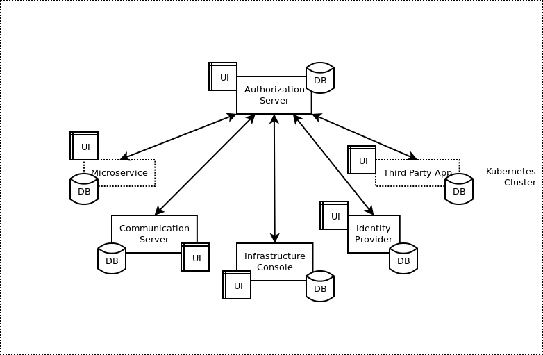

# About

These are set of apps to build an OAuth 2.0 Infrastructure to host Users and Client Apps.
It allows dynamic client registration and client registration for third party apps.

### Development

Start development environment. Refer [section](/development/README.md)

DO NOT setup local development servers to develop apps based on this authorization server and related service.

Host a common setup under a kubernetes namespace for developers.
