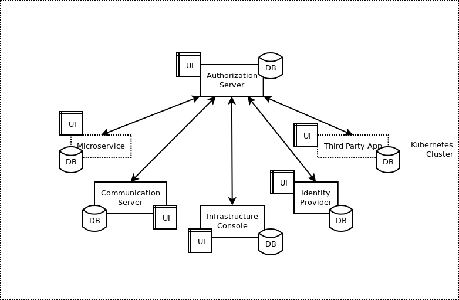

# About

These are set of apps to build an OAuth 2.0 Infrastructure to host Users and Client Apps.
It allows dynamic client registration and client registration for third party apps.

### Features

- OAuth 2.0 and OpenID Connect based Authorization Server API
- Additional RFCs to OAuth 2.0, like PKCE, introspection endpoint, OIDC, etc.
- 2 Factor Authentication using Authenticator App
- OTP based Passwordless login
- Choose to login from multiple accounts
- Identity provider microservice for users to save their profiles
- Easy delete of user for GDPR compliance
- Single Signon using Google Gsuite, Facebook, Github or any OAuth2.0 provider
- Seamless integration with OAuth 2.0 services
- Communication Server API to fire emails and use cloud storage like s3
- Admin Console UI to setup and manage services
- Service registry to query dynamically registered service URLs
- Basic color and branding and whitelabel for Authorization Client UI
- Automated pipeline for testing, building and deploying of services
- CI Workflow can be set to automate releases
- e2e tests to ensure API functionality of authorization server
- Frontend for all services are decoupled, can be replaced by whitelabeled containers
- Frequent upgrades to dependencies for security
- Easy backups, restores and disaster recovery based on kubernetes, velero
- Easy connectivity to data stores
- All IO intensive resource servers are built using NodeJS
- Resource server can be made using preferred language for optimized tasks
- Rolling updates to core service, no downtime during upgrades
- Code structure influenced by Domain Driven Design
- Optional EventStore connection (violates privacy by storing events)
- Optionally notify events to Broadcast Service on TCP (respects privacy by not storing events)
- Webauthn passwordless login using hardware key

### Development

Start development environment. Refer [section](development/README.md)

DO NOT setup local development servers to develop apps based on this authorization server and related service.

Host a common setup under a kubernetes namespace for developers.

### Production

Refer Kubernetes [section](kubernetes/README.md)

### TypeScript API Documentation

* [Authorization Server](https://castlecraft.gitlab.io/building-blocks/api/authorization-server/)
* [Infrastructure Console](https://castlecraft.gitlab.io/building-blocks/api/infrastructure-console/)
* [Identity Provider](https://castlecraft.gitlab.io/building-blocks/api/identity-provider/)
* [Communication Server](https://castlecraft.gitlab.io/building-blocks/api/communication-server/)
* [Admin Client](https://castlecraft.gitlab.io/building-blocks/api/admin-client/)
* [Authorization Client](https://castlecraft.gitlab.io/building-blocks/api/authorization-client/)
* [Identity Provider](https://castlecraft.gitlab.io/building-blocks/api/identity-client/)

### ReST API Swagger Docs

ReST API Docs for each app can be accessed at `/api-docs` and `/api-docs-json`

### Sources

- [Building Blocks](https://gitlab.com/castlecraft/building-blocks)
- [NestJS Resource Server Starter](https://gitlab.com/castlecraft/nestjs-resource-server-starter)
- [gitlab.com/castlecraft](https://gitlab.com/castlecraft)
